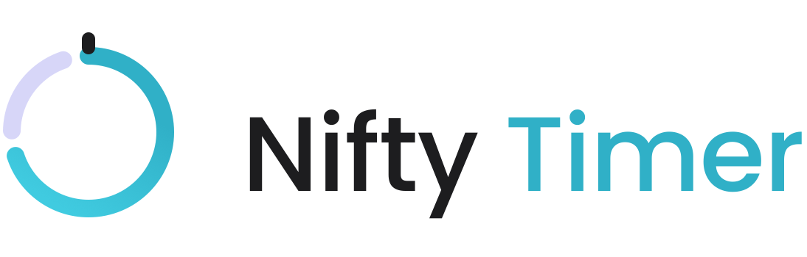

<p align="center">
  <picture>
    <source media="(prefers-color-scheme: dark)" srcset="docs/assets/wordmark-dark.png">
    
  </picture>
</p>

Self-hosted employee time tracking and workforce analytics.
macOS menu bar client (Swift) + NestJS API + Next.js dashboard.

**Read first:**

- `PRD.md` — product spec, architecture, repo structure (§7.1), retention (§10)
- `CLAUDE.md` — engineering rules for humans and AI agents. §0 is non-negotiable.
- `docs/ROADMAP.md` — how we build it, phase by phase; links to per-phase plans and the deployment runbook
- `docs/PREREQUISITES.md` — external things to procure (accounts, certs, infra), when, and why
- `docs/PROJECT-PLAYBOOK.md` — reusable guide for setting up a new project like this one (stack-agnostic)

## Stack (pinned, stable as of 2026-07-11)

Node 24 LTS · NestJS 11.1 (Fastify) · Prisma 7.8 · PostgreSQL 18 · Zod 4.4 ·
Pino 10.3 · Next.js 16.2 / React 19 · BullMQ + Redis · MinIO · pnpm 10 · Vitest

Do not install pre-release/canary/RC tags. NestJS 12 is not stable yet.

## Quickstart

```bash
pnpm install            # also installs the git hooks via `prepare`
cp .env.example .env
pnpm infra:up           # postgres 18 · redis · minio
pnpm db:migrate
pnpm db:seed
pnpm dev                # api :3001 · dashboard :3000
```

## Verify before you claim done

```bash
pnpm lint && pnpm typecheck && pnpm test && pnpm build
```

## What is enforced mechanically, not on trust

| Rule                                        | Enforced by                                                          |
| ------------------------------------------- | -------------------------------------------------------------------- |
| No AI attribution in commits (CLAUDE.md §0) | `.husky/commit-msg`, `.husky/pre-commit`, CI job `no-ai-attribution` |
| Conventional Commits                        | `.husky/commit-msg`                                                  |
| Staged files formatted + linted             | `lint-staged` in `.husky/pre-commit`                                 |
| `apps/*` → `packages/*`, never the reverse  | `eslint-plugin-boundaries` in `eslint.config.mjs`                    |
| Prisma only in `*.repository.ts`            | `no-restricted-imports` in `eslint.config.mjs`                       |
| Sensitive fields never logged               | `REDACT_PATHS` in `packages/logger`                                  |
| Env valid or the process dies               | `loadEnv()` in `packages/config`                                     |
| No monitoring before acknowledgement        | `Policy/AckGate` in the macOS client                                 |

Hooks can be skipped with `--no-verify`, which is why the attribution check also
runs in CI. Both layers are deliberate.

## This is monitoring software

A class of change is off-limits regardless of how the ticket is worded: no hidden
or stealth mode, no keystroke _content_, no webcam/audio/GPS/clipboard capture, no
bypassing the acknowledgement gate, and no manager-visible data an employee cannot
also see about themselves. See CLAUDE.md §1. If a request conflicts with this, stop
and raise it.
